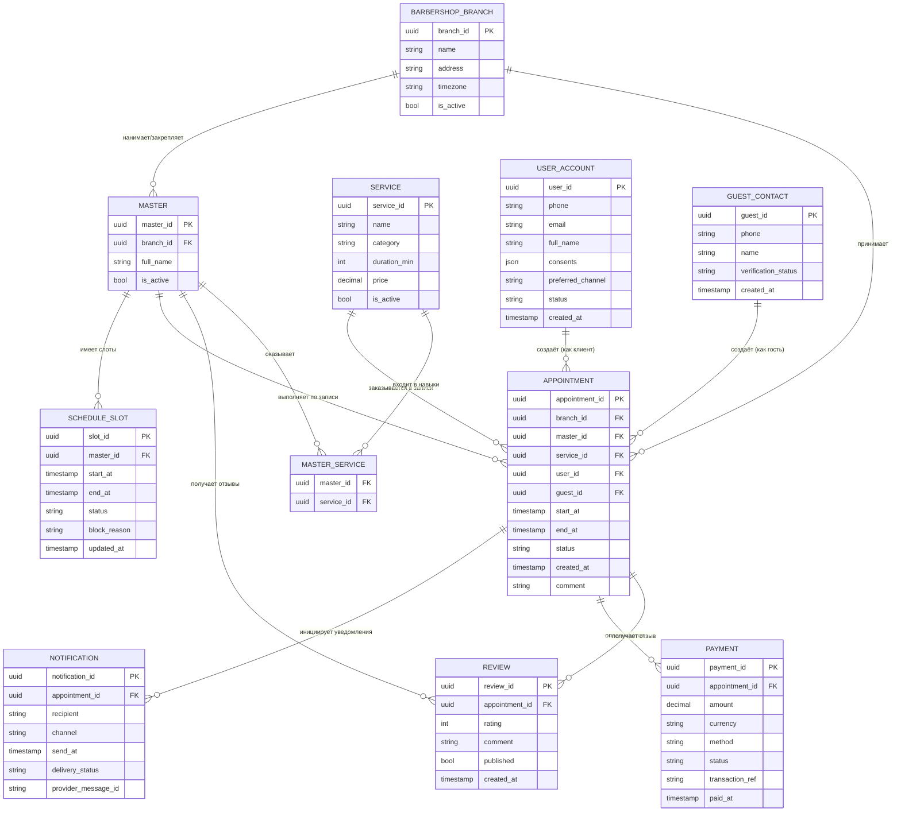

# Exercise 03 — Building a logical data model (Построение логической модели данных)

Задача: 1 — Sign up for a haircut (prefix: `bsh`)

Формат: Mermaid ER diagram (логическая модель данных).

## ER-диаграмма

## Допущения/гипотезы (для согласования)

- `APPOINTMENT` содержит **либо** `user_id` (для зарегистрированного клиента), **либо** `guest_id` (для гостя); оба одновременно не заполняются.
- Справочники статусов (`status`) и каналов (`channel`) показаны как строки/enum (отдельные таблицы можно добавить при необходимости).

