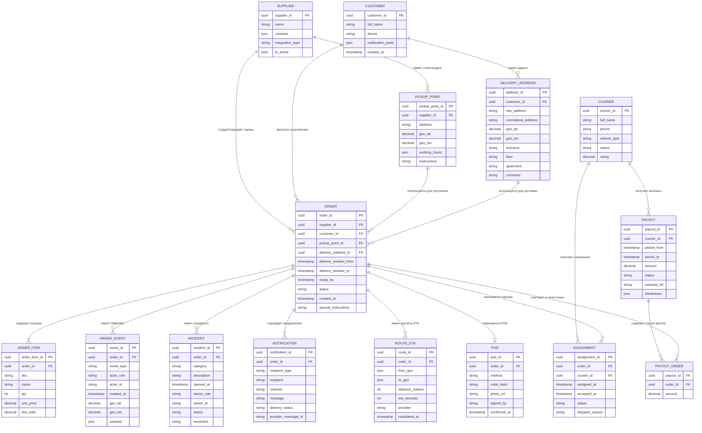

# Exercise 03 — Building a logical data model (Построение логической модели данных)

Задача: 2 — Delivery of orders (prefix: `del`)

Формат: Mermaid ER diagram (логическая модель данных).

## ER-диаграмма

## Допущения/гипотезы (для согласования)

- `DELIVERY_ADDRESS.customer_id` задан как связь “адрес принадлежит клиенту”; если адреса не хранятся в профиле, поле можно сделать необязательным.
- Для выплат добавлена развязочная таблица `PAYOUT_ORDER` (связь M:M между `PAYOUT` и `ORDER`), т.к. выплата обычно агрегирует несколько заказов.
- Справочники статусов (`status`, `vehicle_type`, `channel`) представлены как строки/enum (отдельные таблицы можно добавить при необходимости).

